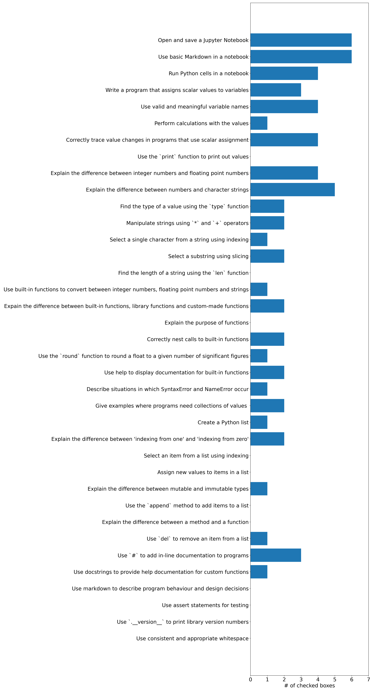

The course is built around a very widely used service in computational science and software engineering - [Github](https://Github.com).
You can see the source code for this website over at the [course Github repository](https://github.com/nu-cem/CompPhys).
If you spot any mistakes or would like to make a suggestions for improving the course please [raise an issue on Github](https://github.com/nu-cem/CompPhys/issues).

## Getting started checklist

We will also be using Github issues to monitor your progress through the first part of the course "Getting Started".

1. Create a Github account (it is free).
2. Go to the [issues page](https://github.com/nu-cem/CompPhys/issues) for this course and click on "New Issue".
3. Next to "Python basics checklist" Click "Get started".
4. **Without** editing any test, click "Submit new issue".
5. Work through the tutorials and questions for part one ("Getting Started"). Tick off items on the checklist as you progress through the course.

> Info: If you want to find your issue again, go back to the issues page and search for your username using `author:username` in the search bar.

## Class report

