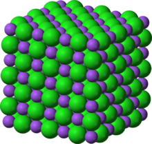

# The Madelung constant

*Taken from Mark Newman's book "Computational Physics, p. 74*

The Madelung constant gives the total electric potential felt by an atom in a solid. It depends on the charge and position of other nearby atoms.

Consider the compound sodium chloride. These are arranged on a cubic lattice, with sodium having a positive charge ($+e$) and chlorine having a negative charge ($-e$). If each atom position is given by integers $(i,j,k)$ then the sodium atoms are at positions where $i+j+k$ is even and the chlorine atoms are at positions where $i+j+k$ is odd.

For an atom at $i=j=k=0$, the Madelung constant $M$ can be approximated by using the following formulae:

$V_\mathrm{total} = \sum_{i,j,k} V(i,j,k) = \frac{e}{4*\pi*\epsilon_0a}M$

$V(i,j,k) = \pm\\frac{e}{4*\pi*\epsilon_0r$

where $r$ is the distance from the origin to the atom at position $(i,j,k)$ and $a$ is the lattice spacing. The summation runs from $i,j,k=-L$ to $i,j,k=L$ but not including $i,j,k=0$ (otherwise the expression would "blow up").

a) Write an expression (in Markdown/LaTeX) for the distance $r$ in terms of $i$,$j$,$k$ and $a$.

b) Calculate the Madelung constant for sodium chloride using a large a value as L as you can (so the code runs in about a minute or less). How does it compare with published values?

---

Back to [Python part two](https://nu-cem.github.io/CompPhys/2021/08/02/Python_basics_two.html).

---

